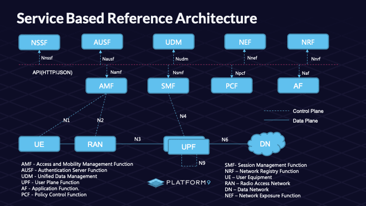

# Deploy [free5GC](https://free5gc.org/) with Docker



## 0. Install GTP5G kernel module
* Required
```
$sudo apt update -y
$sudo apt -y install gcc g++ cmake autoconf libtool pkg-config libmnl-dev libyaml-dev
$git clone https://github.com/free5gc/gtp5g.git
$cd gtp5g
$make clean && make
$sudo make install
```

## 1. Clone or download 
* https://github.com/free5gc/free5gc-compose

```
$git clone https://github.com/free5gc/free5gc-compose.git
$cd free5gc-compose
```

## 2. Pull images from Docker Hub
```
$docker compose pull
```

## 3. Start containers
```
$docker compose up -d
$docker compose ps
```

Access to WebConsole
* http://localhost:5000
  * user=admin
  * password=free5gc