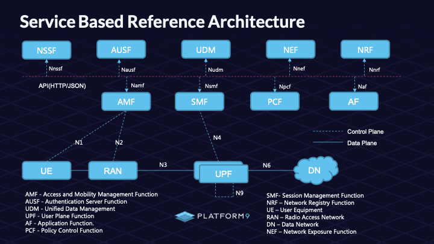

# Deploy [free5GC](https://free5gc.org/) with K8s



## 0. Install GTP5G kernel module
* Required
```
$sudo apt update -y
$sudo apt -y install gcc g++ cmake autoconf libtool pkg-config libmnl-dev libyaml-dev
$git clone https://github.com/free5gc/gtp5g.git
$cd gtp5g
$make clean && make
$sudo make install
```

## 1. Deployment scripts 
* https://github.com/free5gc/free5gc-helm

Install [Helm](https://helm.sh/)
```
$curl -fsSL -o get_helm.sh https://raw.githubusercontent.com/helm/helm/master/scripts/get-helm-3
$chmod 700 get_helm.sh
$./get_helm.sh

```
Check helm
```
$helm version
```

## 2. Start k8s cluster with [minikube](https://minikube.sigs.k8s.io/docs/)
```
$minikube start

$minikube status
type: Control Plane
host: Running
kubelet: Running
apiserver: Running
kubeconfig: Configured
```

Get nodes in cluster
```
$kubectl get node
NAME       STATUS   ROLES           AGE   VERSION
minikube   Ready    control-plane   61s   v1.32.0
```

## 3. Install multus-cni
* Kubernetes network plugin

```
$git clone https://github.com/k8snetworkplumbingwg/multus-cni.git
$cd multus-cni
$kubectl apply -f deployments/multus-daemonset.yml

$kubectl get all --namespace kube-system
```

## 4. Deploy with Helm chart
```
$helm repo add towards5gs 'https://raw.githubusercontent.com/Orange-OpenSource/towards5gs-helm/main/repo/'
$helm repo update
$helm search repo
```

Install
```
$helm -n free5gc install free5gc-v1 towards5gs/free5gc
$helm -n free5gc install ueransim-v1 towards5gs/ueransim
```

Get all pods, deployment and services
```
$kubectl get pods --namespace free5gc
$kubectl get deploy --namespace free5gc
$kubectl get services --namespace free5gc
```

## 5. Expose service
```
$kubectl port-forward --namespace free5gc svc/webui-service 5000:5000
```

Access to WebConsole
* http://localhost:5000
  * user=admin
  * password=free5gc

## 6. Open k8s dashboard
```
$minikube dashboard
```

## 7. Add monitoring system
```
$helm repo add prometheus-community https://prometheus-community.github.io/helm-charts
$helm repo update

$kubectl create namespace prometheus
$helm install prometheus prometheus-community/kube-prometheus-stack -n prometheus

$kubectl get service -n prometheus
$kubectl get pods -n prometheus
```

Expose port of grafana
```
$kubectl port-forward -n prometheus svc/prometheus-grafana 8080:80
```

Access to WebConsole
* http://localhost:8080
  * user=admin
  * password=prom-operator
